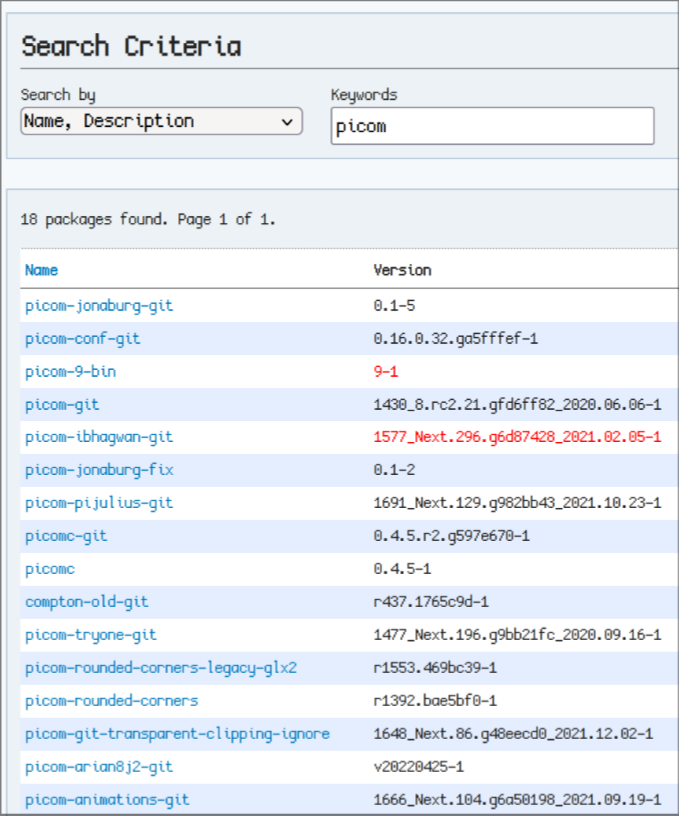

# Rolling your own Wayland Desktop Environment
### Part 1 - Introduction and Hyprland

The art of *nix desktop customization - colliquially and henceforth referred to as "ricing" - is a delictably deep rabbit hole. Users' natural tendency to overengineer everything expresses itself in a myriad of colors and animations on /r/UnixPorn, desktop threads, etc. But where to begin?

## This Series of Articles
- Part 1 - Introduction and Hyprland
- Part 2 - Configuration Tracking and Packaging
- Part 3 - Eww
- Part 4 - Other Applications

## Picking a Distro
While not as important as subsequent steps, it is important to consider the distro a custom desktop envioronment (or **rice**) will be running on. Fixed release options such as Debian Stable or Slackware are typically avoided due to out of date packages in favor of rolling release distros. Arch is a great pick not only for the bleeding-edge software but also for the AUR, in which plenety of ricing packages and branches can be found. Fedora is another example of a rolling distro with bleeding-edge packages. 

I am choosing Fedora 37 KDE for this rice because it has:
- Bleeding-edge packages
- Excellent support for this rice's hardware (Framework laptop)
- A solid foundation (login screen, polkit, etc) to start from
- A KDE Plasma session to use for troubleshooting
- COPR repositories for obscure utilities

Do remember that the distro choice is not terribly important. Don't waste too much time here - when in doubt, pick what you are most comfortable with.

## Picking a Compositor
Unlike X11, Wayland window managers double as compositors. Or more accurately Wayland compositors double as window managers. If you prefer stacking windows - the default behavior on Windows and OS X - KDE, Enlightenment, and GNOME Mutter all support Wayland. But the bread and butter of ricing enthusiasts is the [tiling window manager](https://en.wikipedia.org/wiki/Tiling_window_manager):


Unfortunately, most tiling window managers are built on X11 and incompatible with the Wayland protocol. Wayland's development and adoption has been slow - and for good reason, but that's a holy war we won't get into right now - so there are fewer options to choose from. I looked at:
- [Sway](https://github.com/swaywm/sway)
    - Most active development, largest community
    - Drop-in replacement for i3
    - Developed by authors of [wlroots](https://gitlab.freedesktop.org/wlroots/wlroots) whom are also core Wayland contributors
    - Does not offer advanced compositing features
- [Qtile](https://github.com/qtile/qtile)
    - Configuration in python
    - Wayland support is not feature-complete
    - Does not offer advanced compositing features
- [River](https://github.com/riverwm/river)
    - Configuration is a shell script
    - Barebones documentation
    - Does not offer advanced compositing features

You may be noticing a trend at this point. "Advanced compositing features" such as animations, transparency, shadows, blur, and rounded corners are the reason [picom](https://wiki.archlinux.org/title/Picom) - the defacto ricer X11 compositor - has dozens of confusing forks to choose from:

[Hyprland](https://github.com/hyprwm/Hyprland)

```To make matters worse, some of these forks have incompatible configuration options and backends. You'll have to massage the configuration file for a few minutes to get picom running again. Maybe the new fork will fix one effect, but then there's a different problem with *that* effect on *this* backend, better swap backends again to make sure, wait have I tried glx-xrender-hybrid on picom-jonaburg-*fix* yet? Dang, gotta go back...```

You may hit the lottery with the correct combination of GPU, CPU, kernel, drivers, fork, alignment of Neptune, etc and get picom working smoothly. I did on my last machine after hours of tinkering and felt a wave of relief. 

Sway and River are focused on efficiency, stability, and relative simplicity. Qtile is primarily an X11 window manager and therefore its Wayland implementation does not focus much on compositing. I was preparing to start digging through Sway forks or check back on Wayland in another year, until..

## Hyprland

From [Hyprland](https://github.com/hyprwm/Hyprland)'s project description:

    Hyprland is a dynamic tiling Wayland compositor based on wlroots that doesn't sacrifice on its looks.

Fuck yes.

In all seriousness though, Hyprland is a fantastic compositor. It supports all the features in the above jumble of Picom forks - animations, transparency, blur, shadows, and rounded edges - out of the box on Wayland. There's also a wiki for documentation and the developers are very responsive. The compositor decision may have been tougher if stability or efficiency was prioritized over eyecandy, but Hyprland is the obvious choice for this project.

Installing one's compositor of choice is left as an exercise to the reader, as the focus of this article is more on architecting and deploying the configuration. It's probably safe to assume that if you've read this far you're familiar with R-ing T F-ing M and installing software. 

## hyprland.conf
A good place to dive in is explaining each section of this rice's `.config/hypr/hyprland.conf`. While no two configurations are identical, hopefully some princples discussed will be helpful.

    # laptop screen - 150% scaling; 45px margin at top for statusbar
    monitor=eDP-1, preferred, auto, 1.5
    monitor=eDP-1, addreserved, 45, 0, 0, 0

eDP-1 is the name of the laptop's primary monitor, obtained via `hyprctl monitors`. If starting from scratch, `monitor=,preferred,auto,1` will automatically lay out any detected monitor at its preferred resolution.

    # set cursor theme
    exec-once = hyprctl setcursor Gruvbox 32
    # wallpaper slideshow
    exec-once = python ~/scripts/randomWallpaper.py

Sets the cursor theme (installed separately) and starts a simple [swww](https://github.com/Horus645/swww) script...

    import os
    import random
    import time

    wpDir = os.path.join(os.path.expanduser('~'), 'wallpapers')
    tMins = 15

    os.system('swww init')
    time.sleep(.25)         # ensure swww has started

    while True:
        randImg = os.path.join(wpDir, random.choice(os.listdir(wpDir)))
        
        os.system(f'swww img {randImg}')

        time.sleep( tMins * 60 )

...which changes the wallpaper to a random file from ~/wallpapers every 15 minutes.

### Python?! This could/should all be in POSIX Shell!
Yes, it could/should be. Feel free to use something more suckless in your implementation. Python is easy, I am lazy, and modern systems are more than fast enough. Anyway...

    # eww statusbar
    exec-once = eww daemon
    exec-once = eww open-many w_volume w_brightness w_music \
        w_workspaces w_wintitle w_tray w_bluetooth w_nowplaying
    # eww + hyprland bridge
    exec-once = python ~/.config/eww/scripts/hypr.py

Hyprland and [Elkowar's Wacky Widgets](https://github.com/elkowar/eww) are the backbone of this rice. The status bar, notifications, and tray widgets are all eww windows. `hypr.py` connects to Hyprland's event socket and listens for window/workspace updates, passing relevant state data through to eww's window title and workspace widgets. We'll get more into that later. Next up in `hyprland.conf`:
    
    # networking service
    exec-once = sudo systemctl start NetworkManager
    # notification service
    exec-once = dunst
    # authentication service
    exec-once = /usr/libexec/kf5/polkit-kde-authentication-agent-1
    # KDE connect service
    exec-once = /usr/libexec/kdeconnectd
    # battery monitor
    exec-once = python ~/scripts/batteryCtl.py
    
Because tiling window managers like Sway and Hyprland are *window managers* and not desktop environments, they don't automatically start any system services upon login. It'd be easy to autostart all KDE's services by initializing the Plasma desktop, but we can also cherrypick the few we need (our roll our own) and start them manually.

This next section starts [music player daemon](https://www.musicpd.org/) and sets up a modified [aart](https://git.sr.ht/~hnaguski/aart) script to handle album art: 

    # placeholder for album art
    exec-once = cp ~/.config/ncmpcpp/placeholder.png /tmp/aart
    # music daemon, album art, event handler
    exec-once = mpd
    exec-once = bash ~/scripts/aart.sh
    exec-once = python ~/.config/eww/scripts/mpcIdle.py
    
mpd is a backend which which we will control with [ncmpcpp](https://github.com/ncmpcpp/ncmpcpp), a common setup with tiling window managers. The configuration files can be a bit finnicky but the payoff is well worth it. For now, it should be sufficient to point `music_directory` in `.config/mpd/mpd.conf` at your library. I won't go any more in depth in this series as there are [far better resources](https://wiki.archlinux.org/title/Music_Player_Daemon) on configuring mpd available elsewhere.

## Initial launch layout
The next section of `hyprland.conf` autostarts a terminal in the first workspace and an album art window, music player, and visualizer in the fifth (music) workspace.

    # workspace 1 terminal
    exec-once = kitty

    # workspace 5 album art
    windowrule=workspace 5 silent,Sxiv
    exec-once=sxiv /tmp/aart -b -g 512x512+53+95

    # workspace 5 music player
    windowrule=float,ncmpcpp
    windowrule=workspace 5 silent,ncmpcpp
    windowrule=size 845 418,^(ncmpcpp)$
    windowrule=move 615 116,^(ncmpcpp)$
    exec-once=kitty --class ncmpcpp ncmpcpp

    # workspace 5 music visualizer
    windowrule=float,cava
    windowrule=workspace 5 silent,cava
    windowrule=move 365 657,^(cava)$
    windowrule=size 642 240,^(cava)$
    exec-once=sleep 2 && kitty --class cava cava

    # clean up window rules
    exec-once=python scripts/postStart.py

The syntax is a bit verbose, but all this does is open a few floating windows of specific sizes in specific positions. We pass the `--class` flag to `kitty` to apply class-based window rules. [Simple X Image Viewer](https://github.com/muennich/sxiv), or sxiv, does not require rules as it accepts a geometry argument to specify location and offseet from origin. `postStart.py` removes these rules so subsequent instances of sxiv and kitty behave normally:

    import os
    import time

    time.sleep(5)
    os.system('hyprctl keyword windowrule \"workspace unset,cava\"')
    os.system('hyprctl keyword windowrule \"workspace unset,ncmpcpp\"')
    os.system('hyprctl keyword windowrule \"workspace unset,Sxiv\"')
    os.system('hyprctl keyword windowrule \"size unset,cava\"')
    os.system('hyprctl keyword windowrule \"move unset,cava\"')
    os.system('hyprctl keyword windowrule \"move unset,ncmpcpp\"')
    os.system('hyprctl keyword windowrule \"size unset,ncmpcpp\"')

This pattern is [recommended](https://wiki.hyprland.org/FAQ/#how-do-i-autostart-my-favorite-apps) on the Hyprland wiki. Next up is a [Wofi](https://hg.sr.ht/~scoopta/wofi) (**W**ayland R**ofi** - an application launcher) animation rule.

    # application launcher slide-in animation
    # IMPORTANT: normal_window=true must be set in wofi config
    windowrule=move 400 12,^(wofi)$
    windowrule=animation slidein,^(wofi)$

Hyprland only has one animation for Wayland layers (fade) and we want our application launcher to slide in from the top of the screen. A killer feature of Wofi is its ability to spawn as a normal window instead of a layer like most application launchers. This allows the larger set of window animations - including slidein - to be applied. The first rule is where it will end up after sliding in. Slick!

# wofi animation gif ####

The last unique piece of `hyprland.conf` is from [this](https://gist.github.com/PowerBall253/2dea6ddf6974ba4e5d26c3139ffb7580) excellent writeup regarding getting OBS working on Wayland.

    #screensharing
    exec-once = dbus-update-activation-environment --systemd WAYLAND_DISPLAY XDG_CURRENT_DESKTOP

The gist (ha) of it is to install pipewire and wireplumber (default on Fedora 37), install xdg-desktop-portal-wlr, and uninstall competing xdg-desktop-portal-* packages (including xdg-desktop-portal-kde). Rebooting and including the above line in our Hyprland config will enable screen capture under Wayland via Pipewire.

Phew, done with the thick stuff (for now). Next up is eyecandy - borders, shadows, rounded corners, and the like.

## Window Decoration

    general {
        gaps_in = 5
        gaps_out = 10
        border_size = 2
        col.active_border = rgba(BDAE93FF)
        col.inactive_border = rgba(504945FF)

        layout = dwindle
    }

    decoration {
        rounding = 1
        blur = yes
        blur_size = 5
        blur_passes = 1
        blur_new_optimizations = on

        drop_shadow = yes
        shadow_range = 10
        shadow_render_power = 3
        shadow_offset = 4 4
        col.shadow = rgba(22222280)
    }

    animations {
        enabled = yes

        bezier = myBezier, 0.05, 0.9, 0.1, 1.05

        animation = windows, 1, 7, myBezier
        animation = windowsOut, 1, 7, default, popin 80%
        animation = border, 1, 10, default
        animation = fade, 1, 7, default
        animation = workspaces, 1, 6, default
    }

    misc {
        disable_hyprland_logo = true
        disable_splash_rendering = true
    }

    input {
        kb_layout = us
        follow_mouse = 1

        touchpad {
            tap-to-click = yes
            middle_button_emulation = yes
            natural_scroll = yes
        }

        sensitivity = 0
    }

    dwindle {
        pseudotile = yes
        preserve_split = yes
    }

    master {
        # See https://wiki.hyprland.org/Configuring/Master-Layout/ for more
        new_is_master = true
    }

## Keybinds
Keybinds are of paramount importance in a tiling window manager like Hyprland. A setup like this will feel clunky and unnatural to users who prefer GUI applications - the true power of a TWM is only unlocked when combined with terminal-based workflows and related tooling. When you spend hundreds of hours a month working with computers, it can be more ergonomical and efficient to do everything with the keyboard instead of reaching for the mouse every couple seconds. 

We'll start implementing keybinds in `hyprland.conf` by defining our main modifier key - used in all other keybinds - as `SUPER`. You can pick alt, ctrl, or shift instead if you prefer. Then we'll define a handful of shortcuts to open frequently used applications:

    $mainMod = SUPER

    bind = $mainMod, RETURN, exec, kitty
    bind = $mainMod, V, exec, kitty nvim
    bind = $mainMod, R, exec, kitty ranger
    bind = $mainMod, P, exec, wofi --color ~/.config/wofi/colors

Fairly straightforward. [Kitty](https://github.com/kovidgoyal/kitty) is my terminal emulator of choice, [ranger](https://github.com/ranger/ranger) is a TUI file manager with thumbnail support, [Wofi](https://hg.sr.ht/~scoopta/wofi) is our application launcher, and hopefully Neovim needs no introduction. Now we can press `super + V` to open Neovim at any time, or `super + P` to launch a program from Wofi. The next set of bindings handles Hyprland functions:

    bind = $mainMod, F, fullscreen
    bind = $mainMod, W, togglefloating
    bind = $mainMod SHIFT, C, killactive
    bind = $mainMod SHIFT, Q, exec, wayland-logout

Standard functionality for most tiling window managers: toggle fullscreen for the focused window, toggle floating/tiling status, close a window, and log out. 

[Wayland-logout](https://github.com/soreau/wayland-logout) is a third party package required to... Cleanly end a Wayland session. For some reason the bundled utility `hyprctl`'s `exit` function leaves child processes running when killing the compositor, but manually sending a SIGTERM to Hyprland works as expected. Can you hear the siren song of X calling you back by now? The things we do for animations...

Speaking of animations, let's put the "fun" and "function" back in "function keys" (I'm so sorry) with some `Fn` key bindings:

    # volume function keys
    bind =,XF86AudioMute, exec, python ~/scripts/audioCtl.py mute
    bind =,XF86AudioRaiseVolume, exec, python ~/scripts/audioCtl.py up
    bind =,XF86AudioLowerVolume, exec, python ~/scripts/audioCtl.py down

    # brightness function keys
    bind =,XF86MonBrightnessDown, exec, python ~/scripts/brightnessCtl.py down
    bind =,XF86MonBrightnessUp, exec, python ~/scripts/brightnessCtl.py up

    # media function keys
    bind =,XF86AudioPrev, exec, mpc prev 
    bind =,XF86AudioPlay, exec, mpc toggle
    bind =,XF86AudioNext, exec, mpc next

`audioCtl.py` and `brightnessCtl.py` are thin wrappers around `pactl` and `light` respectively. These scripts also update the state of Eww variables, allowing us to do things like reveal the volume meter with an animation when a volume key is pressed. The media function keys send simpler commands because we will be writing a separate script to update music-related Eww variables later.

Some of the last custom keybinds are to set wallpapers.

    # wallpapers
    bind = $mainMod, O, exec, swww img $(ls -d ~/wallpapers/* | shuf -n 1)
    bind = $mainMod SHIFT, O, exec, swww img ~/wallpapers/01.png
    bind = $mainMod CTRL, O, exec, swww img ~/wallpapers/02.png

`Super + O` cycles to a new random wallpaper from ~/wallpapers while `super + shift + O` and `super + ctrl + O` switch to specific wallpapers. These and the last keybind are entirely optional.

To explain this last bind, let's talk about what Hyprland refers to as the "special workspace" and other tiling window managers refer to as the "scratchpad".

    # alt+tab to send/bring back from scratchpad
    bind = ALT, TAB, exec, python ~/scripts/scratchpad.py

## Default keybinds
These last couple dozen binds are straight from the example Hyprland config and should feel familiar to anyone who's used a tiling window manager before. `Super + h,j,k,l` to move focus around the screen, `super + 1-7` switches to a different workspace, `shift + super + 1-7` moves a window to a different workspace, and floating windows can be dragged/resized with the mouse.

    # Move focus with mainMod + HJKL
    bind = $mainMod, H, movefocus, l
    bind = $mainMod, L, movefocus, r
    bind = $mainMod, K, movefocus, u
    bind = $mainMod, J, movefocus, d

    # Switch workspaces with mainMod + [0-9]
    bind = $mainMod, 1, workspace, 1
    bind = $mainMod, 2, workspace, 2
    bind = $mainMod, 3, workspace, 3
    bind = $mainMod, 4, workspace, 4
    bind = $mainMod, 5, workspace, 5
    bind = $mainMod, 6, workspace, 6
    bind = $mainMod, 7, workspace, 7

    # Move active window to a workspace with mainMod + SHIFT + [0-9]
    bind = $mainMod SHIFT, 1, movetoworkspace, 1
    bind = $mainMod SHIFT, 2, movetoworkspace, 2
    bind = $mainMod SHIFT, 3, movetoworkspace, 3
    bind = $mainMod SHIFT, 4, movetoworkspace, 4
    bind = $mainMod SHIFT, 5, movetoworkspace, 5
    bind = $mainMod SHIFT, 6, movetoworkspace, 6
    bind = $mainMod SHIFT, 7, movetoworkspace, 7

    # Move/resize windows with mainMod + LMB/RMB and dragging
    bindm = $mainMod, mouse:272, movewindow
    bindm = $mainMod, mouse:273, resizewindow

## Starting Hyprland
Run it

## Wrapping Up
Explain it