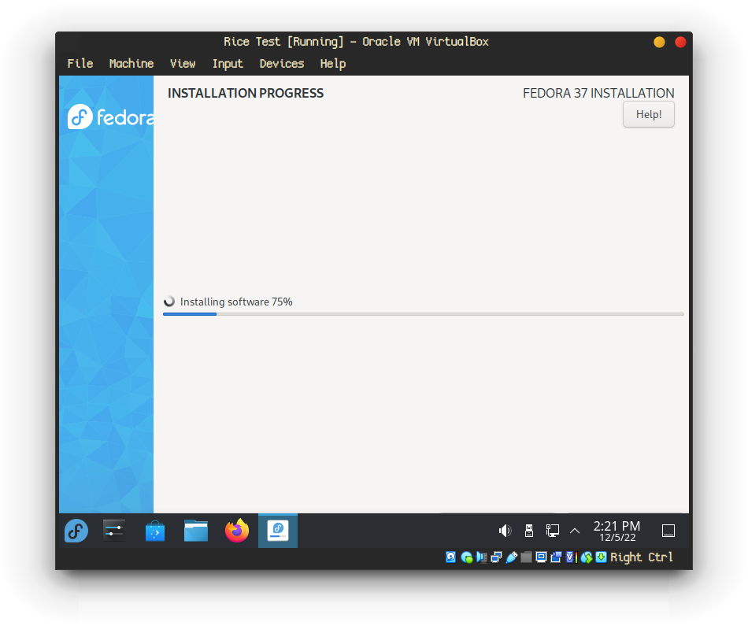

# Rolling your own Wayland Desktop Environment
### Part 2 - Packaging and Deploying the Rice

## Minimal Repeatable Loop
With a distro and compositor in mind, it's tempting to rush ahead and start customizing all the things. Before you know it, you've touched a half dozen system configuration files, added three repositories, built a couple programs from source, changed the default shell, and have absolutely no idea how to reproduce everything you just did. Oops..

In game programming, we start from the **minimal repeatable loop** - display menu, start game, spawn, die, view points, restart game. This is boring, but it's important to get a solid foundation beneath our feet before getting wrapped up in implementation details. This way we avoid building up one small part of the system only to realize it doesn't mesh with the whole.

We'll apply a similar concept to ricing and start by creating a collection of binaries and configuration files that is both **complete** and **minimal**.
- **Complete**: All programs, files, tweaks, resources, etc to reproduce the rice are self-contained within. Nothing complains about missing dependencies or files.
- **Minimal**: The above would be easy to achieve by imaging the system, but no one wants to download and dissect 10GB to theme their system. 10KB of configuration files and a 3KB shell script will do the job just fine.

The *nix configuration version of this is being able to start from a clean install, running a set series of commands, and then rebooting into a fully riced environment with everything properly configured. We'll create a test environment using VirtualBox and the same image chosen for the rice (Fedora 37 KDE). 

Once the install is complete, remove the ISO from the virtual disk drive and reboot. Before the dotfiles can be pulled down Git needs to be installed, and before installing anything it's always a good idea to update the system. This can be left running in the background while completing the next step as it will take a few minutes.

    sudo dnf upgrade --refresh -y

This is also a good point to start adding each command to a **setup script**. After getting everything set up inside the VM, **setup.sh** (final version available in repository) will be able to recreate the rice in a single command! Here's what it looks like at this point:

    #! /bin/bash

    dnf upgrade --refresh -y

*Note: `sudo` is dropped as this script will be run as root.*

Sweet! Armed with an updated VM, it's time to start building up the script that will download and configure everything automatically. This rice should work out-of-the-box after running the setup script (assuming you're using the same base image), but feel free to read along and learn how to create your own.

## Managing dotfiles with a bare git repository
There are countless options for managing *nix configuration files, often referred to as **dotfiles** due to their location in the ~/.config directory. My preferred method is using a bare git repository as outlined in this excellent [Atlassian article](https://www.atlassian.com/git/tutorials/dotfiles). This method is fairly suckless - no dependencies except git, no external tooling, no frills - and it gets the job done just fine.

I won't paraphrase the whole article here, but it's definitely worth skimming if you're interested in that type of thing. Here's the tl;dr on how to clone the config files and customize them to your liking:

1. Install Git.

        sudo dnf install -y git

1. Add the following line to `~/.bashrc`. We'll be installing the fish shell shortly, but this will keep aliases consistent while working in bash.

        alias config='/usr/bin/git --git-dir=$HOME/.cfg/ --work-tree=$HOME'

1. Now in the home folder, update the current session to use our new alias and create a .gitignore file:
        
        source ~/.bashrc
        echo ".cfg" >> .gitignore

1. Fork* [this repository](https://github.com/vlfldr/dotfiles-wayland) and clone into a new folder named `.cfg`:

        git clone --bare <your-fork-url> $HOME/.cfg
        config checkout

1. Remove any files `checkout` complains about and run it again. This will populate the `.config` directory with all the files from the repository.

1. Update git settings to not show untracked files. Without this, every file in the home directory *not* being tracked as a dotfile will be listed after git commands. We just want to see what's being tracked and what's been modified.
        
        config config --local status.showUntrackedFiles no

This setup can be a bit confusing at first, so here are the broad strokes:
- The `.cfg` folder is just a renamed `.git` folder containing git metadata. We don't want the repository tracking its own change database, so we add this folder to the `.gitignore`.
- The `config` command is a `git` alias pointing to our dotfiles repository. For example `config config` means `git config`, `config status` will run `git status` on the repo, and files can be added with `config add <file>`.

*Forking allows you to push your own modifications and updates to your own dotfiles repo. If you already have or don't want to create a dotfiles repository, feel free to just clone this one instead. So far, our setup script looks like this:

        <setup script up to this point>

## Fonts, icons, and themes, oh my!
There are two approaches to take here: bundle all required assets with the dotfiles or script out the install. Since we're already knee deep in this setup script, let's opt for the latter. First, we'll need a font.
[Cozette](https://github.com/slavfox/Cozette)
[Fedora docs](https://docs.fedoraproject.org/en-US/quick-docs/fonts/)

KDE resources
[Gruvbox Plasma Theme](https://store.kde.org/p/1327719/)

## Enumerating third-party repositories and packages
If you're creating your own configuration from scratch, it's a good idea to keep track of the packages installed and repositories added as you go. I started writing this article and spinning up my VM long after installing a bunch of things, so there'll be a little extra work involved. First, to list all the third-party repositories on the riced machine:

    ls /etc/yum.repos.d

The three third-party repositories used for this rice are kasion:Hyprland-git, alebastr:sway-extras, and vscodium. These .repo files can be copied to a new `~/.config/setup` directory added to the dotfiles repository using `config add ~/.config/setup`. Add a line to **setup.sh** to copy these files to the appropriate location on new machines:

    mv ~/.config/setup/*.repo /etc/yum.repos.d/

 Next, list all installed packages (except kernel and debuginfo with) with the following command:

    dnf repoquery --qf '%{name}' --userinstalled \
            | grep -v -- '-debuginfo$' \
            | grep -v '^\(kernel-modules\|kernel\|kernel-core\|kernel-devel\)$' > pkgs.txt

After running the above on both the riced machine and the clean VM, the diff will be a list of packages required for the rice. I picked through the output and ended up adding the following to **setup.sh**:

    # install rice packages
    dnf install -y ImageMagick bat bluez borgbackup cava codium fish freeglut fzf git grim slurp kernel-modules-extra \
    kernel-tools hyprland kitty light lsd mpv ncmpcpp neofetch neovim network-manager-applet python3-pillow ranger \
    rpmfusion-free-release rpmfusion-nonfree-release swww sxiv wayland-logout wofi

There was only one core program not available in these repositories: [gotop](https://github.com/xxxserxxx/gotop). 

#### gotop screenshot ####

TL;DR htop but prettier and written in Go. Gotop is fairly stable and does not see releases often, so it's viable to download the latest release and install it in **setup.sh**:

    wget https://github.com/xxxserxxx/gotop/releases/download/v4.2.0/gotop_v4.2.0_linux_amd64.rpm
    dnf install -y ./gotop*.rpm
    rm ./gotop*.rpm

Easy as can be! Programs which are not packaged for Fedora could be included as well, but part of the reason for picking this distro is the excellent repositories. If there was no .rpm available we would bundle or download generic binaries and `mv` them into `.local/bin` or similar.

## Optional programs
Everything installed up to this point has been fairly core to the configuration. It'd be nice to let the user opt out of downloading themes for Firefox Nightly, KDE applications, or any other programs they're not going to use. A simple !!case/if!!

The last step is changing the user's shell to fish:

    # set default shell to fish
    sudo -u "$1" chsh -s /usr/bin/fish

And the setup script is complete! Ideally it should be able to run unattended on a clean install and spit out a working fully riced system.

## Tracking system configuration files
How do we add /etc/<file_i_changed> to config dotfiles repo?
